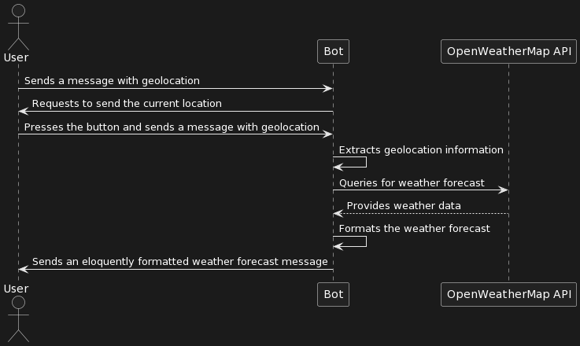

# Telegram Bot Design Document

## Bot Description
The objective of this task is to create a Telegram bot that integrates with the OpenWeatherMap API and provides weather forecasts based on user-provided geolocation.

## Requirements
- The bot should not rely on a command, allowing it to handle custom messages
- Upon receiving a message with geolocation from the user, the bot should extract the location and provide a weather forecast for that location
- The bot should use the OpenWeatherMap API as the data provider
- The bot should format and send a message containing the weather forecast

## Technology Stack

- **Programming Language:** Node.js
- **Telegram Bot Library:** `node-telegram-bot-api`
- **HTTP Client Library:** `axios`
- **API Data Provider:** [Open Weather Map API](https://openweathermap.org/api)

## Bot Flow

1. User starts the bot 
2. Bot requests to send the current location 
3. User sends a message with geolocation
4. Bot extracts the geolocation information from the message
5. Bot queries the OpenWeatherMap API for the weather forecast of the specified location
6. Bot formats the weather information into a message
7. Bot sends the weather forecast message to the user

## Implementation Notes

- The `node-telegram-bot-api` library is used to interact with Telegram and `axios` for making HTTP requests to the OpenWeatherMap API
- The error handling has to be implemented for both the Telegram API and the OpenWeatherMap API interactions

## Testing

- Test the bot in a real Telegram chat to ensure it works as expected, providing accurate and formatted weather forecasts in response to geolocation messages

